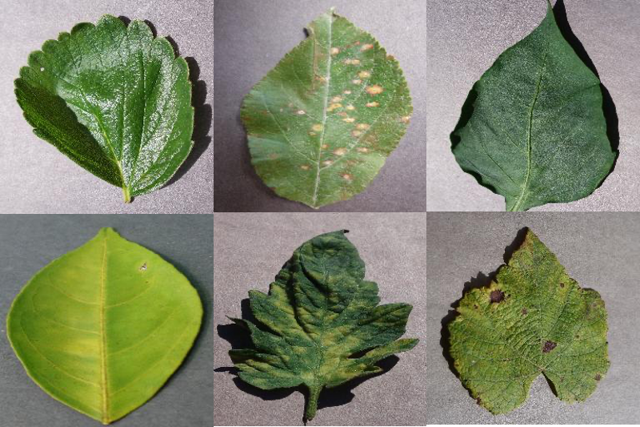
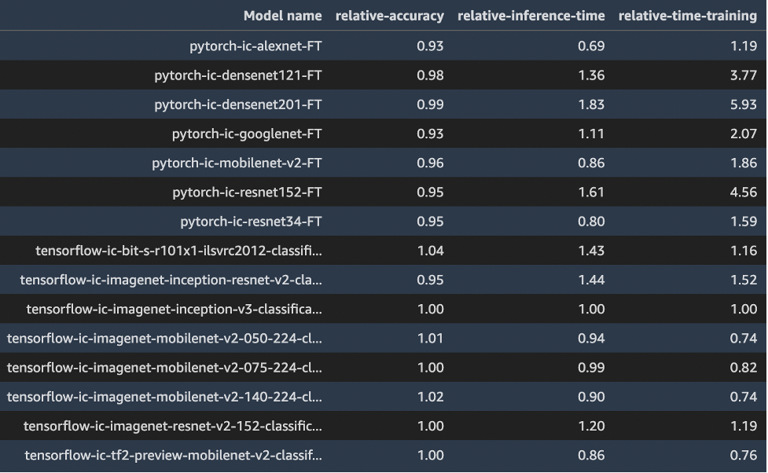
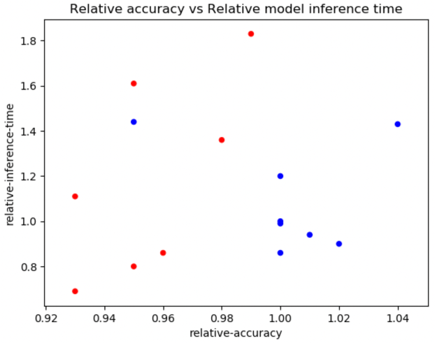

# Compare multiple Image Classification models in JumpStart

## Overview

At times, when you are solving a business problem using machine learning (ML), you might
want to use multiple ML algorithms and compare them against each other to see which
model gives you the best results on dimensions that you care about - model accuracy,
inference time, and training time.

In this notebook, we demonstrate how you can compare multiple image classification
models and algorithms offered by SageMaker JumpStart on dimensions such as model
accuracy, inference time, and training time. Models in JumpStart are brought from hubs
such as TensorFlow Hub and PyTorch Hub, and training scripts (algorithms) were written
separately for each of these frameworks. In this notebook, you can also alter some of the
hyper-parameters and examine their effect on the results.

Image Classification refers to classifying an image to one of the class labels in the training
dataset.

Amazon SageMaker JumpStart offers a large suite of ML algorithms. You can use JumpStart
to solve many Machine Learning tasks through one-click in SageMaker Studio, or through
SageMaker JumpStart API.

Note: This notebook was tested on ml.t3.medium instance in Amazon SageMaker Studio
with Python 3 (Data Science) kernel and in Amazon SageMaker Notebook instance with
conda_python3 kernel.

## Dataset
The [public dataset](https://paperswithcode.com/dataset/plantvillage) used in this post consists of nearly 55,000 images of diseased and healthy plant leaves collected under controlled conditions, with class labels ranging from 0–38. This dataset is divided into train and validation datasets, with approximately 44,000 under training and 11,000 images under validation. The following are a few sample images.

For this exercise, we selected models from two frameworks—PyTorch and TensorFlow—as offered by JumpStart. The following 15 model algorithms cover a wide range of popular neural network architectures from these frameworks:

- pytorch-ic-alexnet-FT
- pytorch-ic-densenet121-FT
- pytorch-ic-densenet201-FT
- pytorch-ic-googlenet-FT
- pytorch-ic-mobilenet-v2-FT
- pytorch-ic-resnet152-FT
- pytorch-ic-resnet34-FT
- tensorflow-ic-bit-s-r101x1-ilsvrc2012-classification-1-FT
- tensorflow-ic-imagenet-inception-resnet-v2-classification 4-FT
- tensorflow-ic-imagenet-inception-v3-classification-4-FT
- tensorflow-ic-imagenet-mobilenet-v2-050-224-classification-4-FT
- tensorflow-ic-imagenet-mobilenet-v2-075-224-classification-4-FT
- tensorflow-ic-imagenet-mobilenet-v2-140-224-classification-4-FT
- tensorflow-ic-imagenet-resnet-v2-152-classification-4-FT
- tensorflow-ic-tf2-preview-mobilenet-v2-classification-4-FT

## Results

Results from these 15 runs are shown below. For all these runs, the hyperparameters used were epochs = 5, learning rate = 0.001, batch size = 16. 

Model accuracy, training time, and inference time from model tensorflow-ic-imagenet-inception-v3-classification-4-FT were taken as the base, and results from all other models are presented relative to this base model. Our intention here is not to show which model is the best but to rather show how, through the JumpStart API, you can compare results from various models and then choose a model that best fits your use case. 

PyTorch models are color coded in red and TensorFlow models in blue.

While the results shown above are for the Plant Pathology dataset, you can make similar runs on your own dataset. The notebook offered here can help you with that. Please note that the sample data used in this notebook is different from the Plant Pathology dataset. You can download the Plant Pathology data at the link provided above, or even better, use your own dataset.

